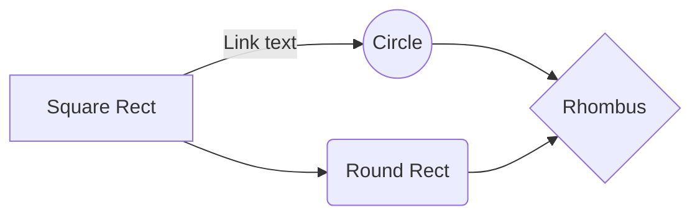
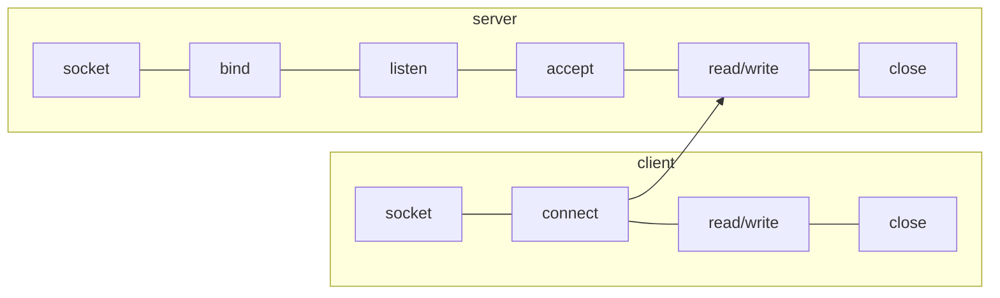

서버와 클라이언트 흐름의 연결

```mermaid
graph LR
    A[Square Rect] -- Link text --> B((Circle))
    A --> C(Round Rect)
    B --> D{Rhombus}
    C --> D
```

```mermaid
graph LR
subgraph server
ssocket[socket] --- bind
bind --- listen
listen --- accept
accept --- srw[read/write]
srw[read/write] --- sclose[close]
end

subgraph client
csocket[socket] --- connect
connect --- crw[read/write]
connect --> srw[read/write]
crw[read/write] --- cclose[close]
end
```

