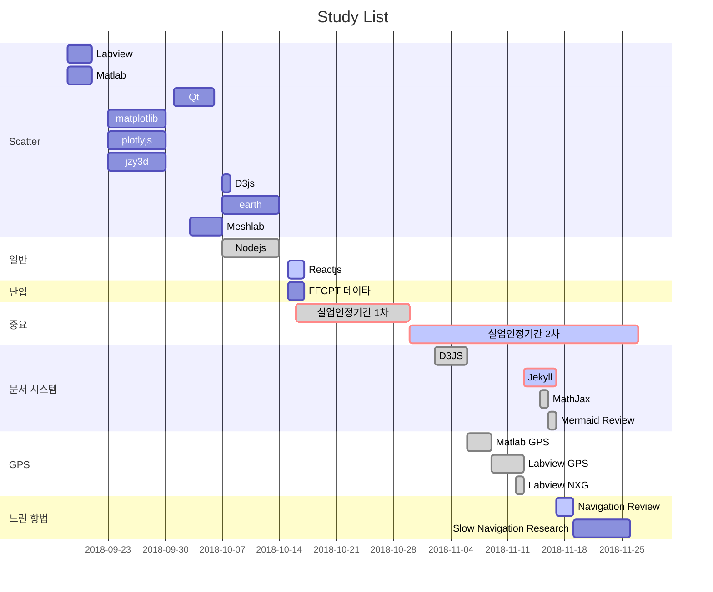

최근 학습 내역을 간트차트에 나타내었다.

### 최근 학습 목록

GPS 세부 항목: Skyplot, Serial, NMEA, State Machine

gantt
dateFormat  YYYY-MM-DD
title Study List

section Scatter
Labview : desS1, 2018-09-18, 3d
Matlab : 2018-09-18, 3d
Qt :  desS3, 2018-10-01, 5d
matplotlib : 2018-09-23, 7d
plotlyjs : 2018-09-23, 7d
jzy3d : 2018-09-23, 7d
D3js : 2018-10-07, 1d
earth : 2018-10-07, 7d
Meshlab : 2018-10-03, 4d

section 일반
Nodejs : done, des5, 2018-10-07,2018-10-14 
Reactjs : active, des1, 2018-10-15,2018-10-17

section 난입
FFCPT 데이타 : 2018-10-15, 2d

section 중요
실업인정기간 1차 :crit, done, 2018-10-16, 2018-10-30
실업인정기간 2차 :crit, active, 28d

section 문서 시스템
D3JS             :done, 2018-11-02,4d
Jekyll           :crit, active, 2018-11-13,4d
MathJax          :done, 2018-11-15, 1d
Mermaid Review   :done, 1d

section GPS
Matlab GPS        :done, 2018-11-06,3d
Labview GPS       :done, 2018-11-09,4d
Labview NXG       :done, 2018-11-12,1d

section 느린 항법
Navigation Review         : active, des06, 2018-11-17, 2d
Slow Navigation Research  : 7d

